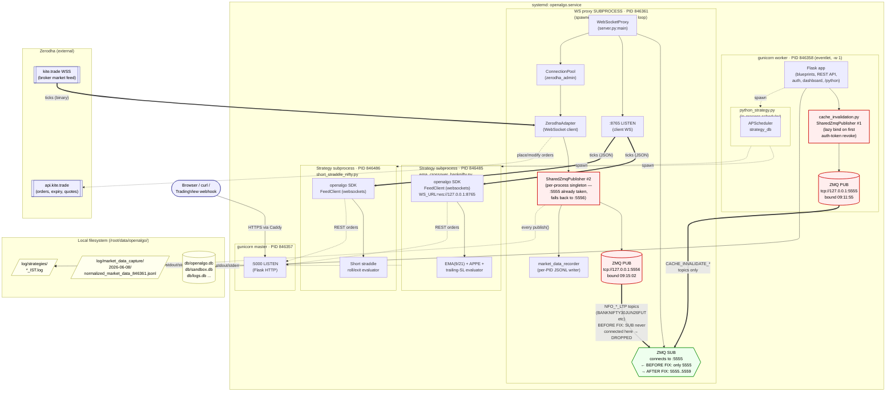

# OpenAlgo runtime architecture & the ZMQ port race (2026-06-08)

This diagram captures the live process layout of `openalgo.service` on
`offramp.oftenuncertain.net` when two strategies and the market-data capture
feature are running, and highlights the per-process `SharedZmqPublisher` race
that caused `Market-data feed STALE` despite a healthy broker feed.

See companion local fix commit `8fe1df37` on `ds/merged/mock/strategies`
(`websocket_proxy/server.py` SUB-connects to a port range now).



## Reading the diagram

**Five real OS processes** live inside `openalgo.service`:

| PID    | Role                                  | Listens on                |
| ------ | ------------------------------------- | ------------------------- |
| 846357 | gunicorn master                       | `:5000`                   |
| 846358 | gunicorn worker (Flask + scheduler)   | (publishes ZMQ `:5555`)   |
| 846361 | WS proxy subprocess                   | `:8765`, ZMQ `:5556`      |
| 846485 | `ema_crossover_banknifty.py`          | (client only)             |
| 846486 | `short_straddle_nifty.py`             | (client only)             |

**The race (red boxes).** Two distinct `SharedZmqPublisher` singletons exist
because Python singletons don't cross process boundaries. The worker's
publisher wins `:5555` at 09:11:55 (lazy bind triggered by an auth-token
revoke during user login). The proxy's publisher then loses the race at
09:15:02 and falls back to `:5556` — silently, with only a `WARNING` log.

**The blocked tick path.** Before today's patch, the proxy's SUB socket
only connected to `:5555`, which carried just `CACHE_INVALIDATE_*` messages
from the worker. Market data on `:5556` had no subscriber. After the patch
the SUB connects to a range (`5555..5559`) so it picks up both wires.

**The capture file (innocent observer).** `market_data_recorder` hooks
`SharedZmqPublisher.publish()` itself, so it captures every tick regardless
of whether anyone SUBs on the wire. That's why
`normalized_market_data_846361.jsonl` was growing with 1,526 BANKNIFTY ticks
while the strategies logged `WS has NEVER delivered a tick this run` — and
how we diagnosed the bug.

**Two strategy SDKs, two WS sessions.** Each strategy subprocess opens its
own `ws://127.0.0.1:8765` connection via the `openalgo` SDK. They don't
share a socket. The WS proxy fans the same broker tick out to both clients.

**Orders flow back via REST**, not the WS pipe — `HOST_SERVER` → port 5000.
That path was never broken, which is why the strategies were "alive" but
trade-blind.

## Regression provenance

Today's bug was **not** introduced by the market-data capture feature.
Two earlier commits interact; either one alone is safe:

| Commit       | Date       | Role in the race                                                                                                                           |
| ------------ | ---------- | ------------------------------------------------------------------------------------------------------------------------------------------ |
| `521ea129`   | 2026-05-05 | `fix(cache_invalidation): route through SharedZmqPublisher (#1374)` — made the Flask request path bind `:5555` lazily. The commit message itself warned: *"would only become user-visible if the proxy were ever decoupled into a separate process."* |
| `d077559f`   | 2026-05-20 | `fix(websocket): spawn WS proxy as subprocess under gunicorn+eventlet (#1421)` — did exactly what #1374 warned about.                       |
| `49a9834e`   | 2026-06-04 | `feat: capture normalized market data events` — innocent; only added a `record_market_data()` hook inside `publish()`. Actually made the bug *diagnosable* via per-PID JSONL filenames. |

## Today's patch (local commit `8fe1df37`, not pushed/deployed)

```diff
- ZMQ_PORT = os.getenv("ZMQ_PORT")
- self.socket.connect(f"tcp://{ZMQ_HOST}:{ZMQ_PORT}")
+ default_port = int(os.getenv("ZMQ_PORT") or "5555")
+ scan_range   = int(os.getenv("ZMQ_SUB_SCAN_RANGE", "5"))
+ for port in range(default_port, default_port + scan_range):
+     self.socket.connect(f"tcp://{ZMQ_HOST}:{port}")
```

## Architectural follow-ups (post market close)

The patch is a band-aid. The right fix is one of:

1. **Move cache invalidation off the market-data wire.** Give it its own
   `inproc://` or `ipc://` channel scoped to the worker process. Restores
   the pre-#1374 separation; eliminates the race entirely.
2. **Fail loud on bind fallback.** Make `SharedZmqPublisher.bind()` raise
   instead of silently moving to `:5556` when `:5555` is taken. Catches
   the bug at boot rather than at the first stale-feed alert.
3. **Reorder subprocess spawn.** Bind the proxy's publisher *before* the
   worker's first request handler runs. Fragile — doesn't survive a proxy
   crash/restart, since the worker would then own `:5555` again.

Option 1 is the cleanest; option 2 is the cheapest safety net to add
alongside the band-aid.
